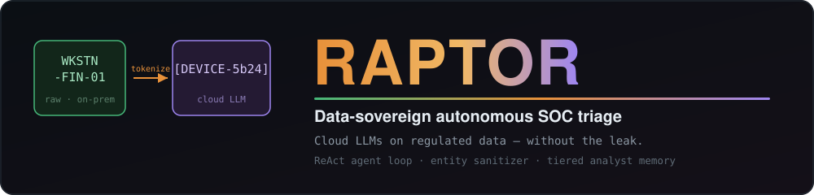
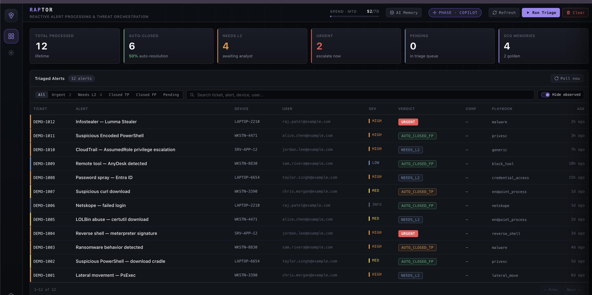
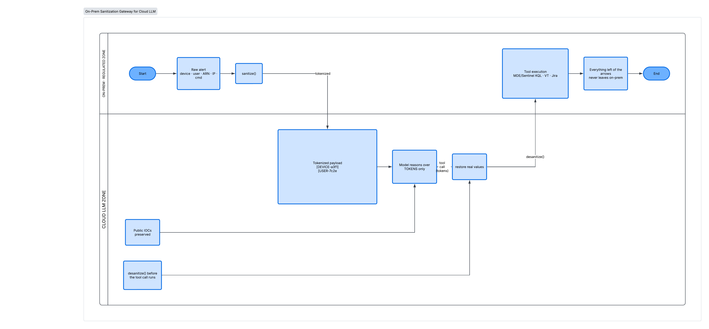
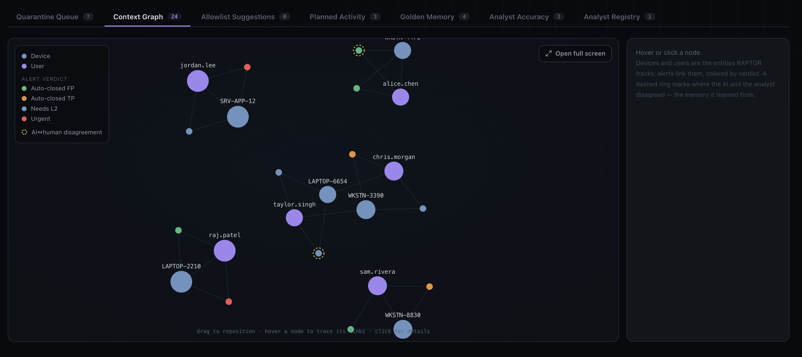
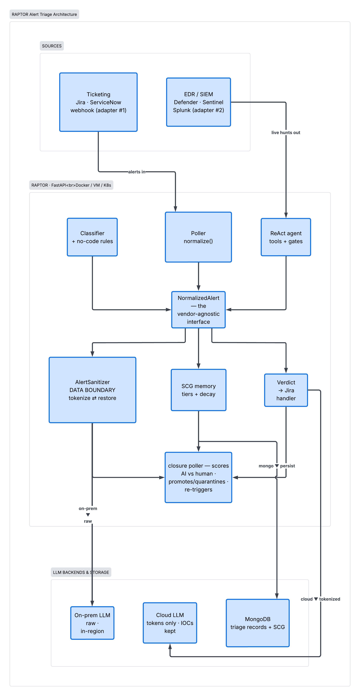
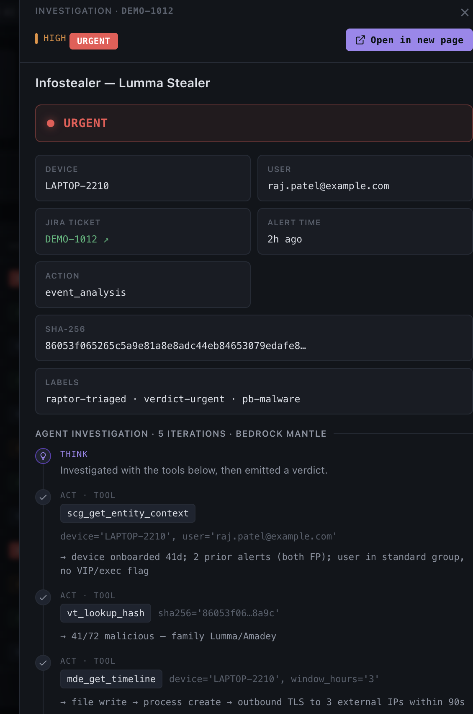
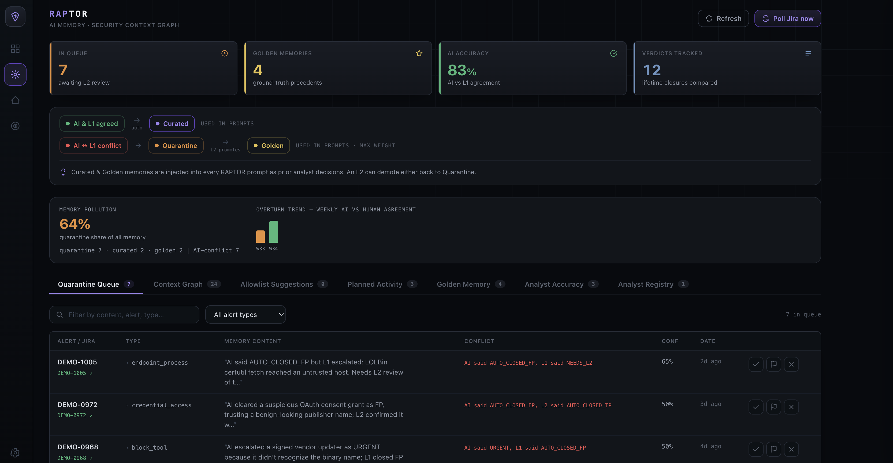

<div align="center">



**Autonomous L1 alert triage that runs cloud LLMs on regulated data without leaking it.**

[](pyproject.toml)
[](LICENSE)
[](docs/attacking-the-boundary.md)
[](demo/README.md)
[](https://github.com/rav3nf0/raptor/commits)
[](https://github.com/rav3nf0/raptor/stargazers)

[Quick start](#quick-start) · [Architecture](#architecture) · [How it compares](#how-it-compares) · [Threat model](#security--threat-model) · [Earning autonomy](#earning-autonomy) · [Contributing](#contributing) · [Docs](#docs)

**[📹 Watch the demo](docs/raptor-demo.mp4)** — triage, boundary, and memory in ~4 minutes.

</div>

---

**RAPTOR** (Regulated-data Autonomous Prioritization, Triage & Orchestrated Response) is an
L1 SOC analyst you can run in your own environment. It polls your ticketing/EDR stack,
classifies each alert, investigates it with a ReAct agent loop over real tools, and posts a
verdict.

Two things make it different. A bidirectional entity sanitizer keeps device names, user
principals, ARNs, internal IPs, and command lines out of every external-LLM call. And a
tiered memory learns from how your analysts actually close tickets, then ages out stale
patterns, so accuracy climbs without collecting bad habits.

> **Status:** extracted from a platform running in a financial-services SOC. Apache-2.0.
> Runs offline on synthetic data with no credentials — see [Quick start](#quick-start).

<div align="center">



<sub>The triage console: every alert classified, investigated, and given a verdict (auto-close FP/TP, Needs L2, Urgent), with the current rollout phase and month-to-date LLM spend up top.</sub>

</div>

## Why it exists

In a regulated environment you usually get two bad options: send alert data to a cloud LLM
and break data-residency rules, or stay on-premise and give up the strongest models. RAPTOR
takes neither. Sensitive identifiers are tokenized before any external-LLM call and restored
before tools run, so the model reasons over tokens while the live queries (Defender/Sentinel
KQL, VirusTotal, Jira) still run on real values. Public IOCs such as hashes and external
domains are left intact, because they are the evidence.

<div align="center">



<sub>The data-sovereignty boundary: sensitive identifiers are tokenized on-prem before any cloud-LLM call and restored before a tool runs. Public IOCs cross as evidence; nothing to the left of the arrows leaves on-prem.</sub>

</div>


The second piece is a tiered analyst-feedback memory, the Security Context Graph. Each
verdict is checked against how the human closed the ticket: agreement promotes the memory
(`quarantine → curated → golden`), disagreement quarantines it for review, and monthly
confidence decay ages out patterns that stop matching reality.

<div align="center">



<sub>The Security Context Graph: devices and users RAPTOR tracks, and the alerts linking them, colored by verdict. Dashed rings mark where the AI and an analyst disagreed. Interactive in the console (AI-Memory tab or full-screen at <code>/memory/graph</code>).</sub>

</div>

## Features

- **Enforced data boundary.** A standalone bidirectional sanitizer tokenizes
  device/user/ARN/IP/SID/command-line values before egress and restores them before tools
  run. The model sees tokens; the tools see real values. [Threat model.](docs/attacking-the-boundary.md)
- **Memory that learns and forgets.** Verdicts are scored against analyst outcomes;
  agreement promotes a memory, disagreement quarantines it, and confidence decays monthly.
- **Interactive context graph.** Devices, users, and the alerts linking them, colored by
  verdict, with rings on AI/analyst disagreements. In the AI-Memory tab or full-screen at
  `/memory/graph`. Plain-canvas, no libraries. [Scaling notes.](docs/scaling-the-graph.md)
- **ReAct agent loop.** Think, act, observe over real tools (MDE/Sentinel KQL hunts,
  VirusTotal, precedent recall, Jira), with deterministic safety gates on the verdict.
- **Dual-LLM routing.** Sensitive classes (CloudTrail, privesc, command-line) go to an
  on-prem model with raw data; the rest take the sanitized cloud path.
- **Vendor-agnostic core.** Every alert becomes a `NormalizedAlert` at intake; the
  classifier, playbooks, agent, boundary, and memory never touch a vendor API. [Portability.](docs/portability.md)
- **No-code routing.** MongoDB-backed rules map alerts to playbooks before the classifier.
- **Offline, no credentials.** Clone, seed synthetic *Northwind Securities* data, and run
  the whole pipeline with no Jira/MDE/LLM keys and no external calls.

## Quick start

Runs offline against synthetic *Northwind Securities* data — no Jira/MDE/LLM credentials, no
external calls. Needs **Python 3.11+** and **Docker**.

```bash
python3.11 -m venv .venv && source .venv/bin/activate   # 3.11+ required
pip install -e .
./demo/run_demo.sh            # MongoDB → seed synthetic data → launch on :10004
```

Open **http://localhost:10004** and log in with **admin / demo**. Prerequisites and the
live-triage hook are in [`demo/README.md`](demo/README.md).

To see the boundary on its own, with no LLM or key:

```bash
python demo/show_boundary.py   # asserts zero leakage; exits non-zero if anything leaks
```

## Architecture

<div align="center">



<sub>Sources → normalize → classify → ReAct agent → data boundary → dual-LLM → verdict, with the closure poller and Security Context Graph feeding learning back in.</sub>

</div>

The middle band is vendor-agnostic. Swap adapter #1 (ticketing) or adapter #2 (the SIEM
query layer) and the classifier, playbooks, agent, boundary, and memory stay the same. See
[Portability](docs/portability.md).

| Package | Responsibility |
|---|---|
| **`edr_triage/`** | poll → classify → playbook pipeline, verdict store |
| **`agent_core/`** | ReAct agent loop, LLM backend abstraction, `sanitize.py` (the boundary), spend budget |
| **`entity_graph/`** | the Security Context Graph: entities, relationships, tiered memory and decay |
| **`agent_tools/`** | tools the agent can call (VirusTotal, MDE/Sentinel KQL, SCG recall, Jira) |
| **`app/`** | FastAPI app, auth, the RAPTOR and AI-Memory views |

## How it compares

Autonomous AI-SOC triage is not new. What is specific to RAPTOR is the combination below: an
enforced application-layer data boundary, memory that reviews and decays, and an open-source
release.

| | Data boundary | Learns from analysts | Open source |
|---|:---:|:---:|:---:|
| Google Sec-Gemini | cloud-hosted | aggregate CTI only | ❌ |
| AWS Security IR | region-scoped | cross-customer CTI | ❌ |
| Dropzone AI | contractual only | context memory (no decay/review) | ❌ |
| Mate Security | undocumented | context graph | ❌ |
| **RAPTOR** | **enforced tokenizer** | **tiered memory + decay** | ✅ |

<sub>Based on public documentation at time of writing; corrections welcome via PR.</sub>

## Security & threat model

The boundary is the core claim, so it ships with a threat model instead of assurances.
[`docs/attacking-the-boundary.md`](docs/attacking-the-boundary.md) covers what it defends,
what it does not, six concrete attack classes (coverage gaps, regex format-evasion,
token-correlation, reverse-channel via the desanitizer, exfil through the public-IOC channel,
short-value bypass), and a hardening roadmap.

Treat the sanitizer as defense-in-depth: a default-deny-by-token filter for the identifiers
it knows about. Run it alongside an egress DLP control and provider no-retention terms, not
instead of them.

## Earning autonomy

RAPTOR does not get write access on day one. Autonomy is earned per alert class, gated on
measured agreement with your analysts, and every verdict records its phase so you always know
whether RAPTOR watched, advised, or acted.

<div align="center">



<sub>Every verdict shows its work: the ReAct trace (think, act, observe) with each tool call, its arguments, and what it returned.</sub>

</div>

| Phase | What RAPTOR does | Ticket state | Scored against humans? |
|---|---|:---:|:---:|
| **Shadow** | triages every alert, records a verdict | writes nothing | yes, vs the outcome on close |
| **Copilot** | posts its verdict and reasoning as an advisory comment | human still decides | yes |
| **Autonomous** | verdict drives ticket state (auto-close FP/TP, transition, labels) | acts, for earned classes | yes, continuously |

- **The gate.** Promotion from copilot to autonomous depends on shadow/copilot accuracy for
  that alert class clearing a threshold. Autonomy is granted where it is proven, not by a
  global switch.
- **The metric.** The accuracy record is never inflated, excluded, or flipped; only genuine
  non-decisions (tool errors and bugs) are dropped, so promotion rests on numbers you can
  trust.
- **Safety gates always apply.** Even in autonomous mode the deterministic gates can only
  move a verdict toward escalation, and the highest-sensitivity classes can stay
  human-in-the-loop indefinitely.

> The bundled demo runs in copilot mode (advisory, `EDR_DRY_RUN=true`): RAPTOR shows its work
> and the humans still decide, which is how a SOC would first roll it out.

<div align="center">



<sub>The AI-Memory console: lifetime AI-vs-analyst accuracy, the memory tiers, and the quarantined disagreements that gate promotion (each showing what RAPTOR proposed versus what the analyst decided).</sub>

</div>

## Extend RAPTOR

The interfaces are small on purpose, so you can swap a layer without forking the pipeline.
The full walkthrough is in the [Integration Guide](docs/integration.md); the main seams:

**Bring your own LLM.** Implement two methods, and gate the sanitizer if it is external:

```python
# agent_core/backend.py
class MyBackend(LLMBackend):
    async def chat(self, messages, tools) -> tuple[str, list[ToolCall]]: ...
    async def health_check(self) -> bool: return True
```

**Bring your own ticketing or telemetry.** Keep the `NormalizedAlert` shape and the rest of
the pipeline is unchanged. Swap the Jira poller/handler
(`edr_triage/jira_poller.py`, `jira_handler.py`) for ServiceNow, PagerDuty, or a webhook, and
swap the MDE/Sentinel client for your SIEM. RAPTOR runs on Sentinel/MDE today, but the vendor
coupling lives in two thin adapters. [Portability](docs/portability.md) explains why an
EDR/SIEM change never reaches the triage logic, the boundary, or the memory.

**Add verdict logic.** A playbook is one class:

```python
# edr_triage/playbooks/my_playbook.py
class MyPlaybook(BasePlaybook):
    async def run(self, jira_key, alert, evidence, vt, timeline, **kw) -> PlaybookResult:
        return PlaybookResult(triage_class="NEEDS_L2", l1_comment="…", labels=["mine"])
```

**Route alerts without code.** MongoDB-backed rules are checked before the classifier:

```python
from edr_triage.rules import create_rule
create_rule(pattern="Acme EDR - Suspicious Binary", playbook="malware", match_type="contains")
```

## Use just the boundary

The sanitizer is a standalone, dependency-free primitive. You can drop it into any agentic
LLM pipeline in a regulated environment, with or without the rest of RAPTOR:

```python
from agent_core.sanitize import AlertSanitizer

s = AlertSanitizer(device_name="WKSTN-FIN-4471", user_name="alice.chen@corp.example.com")
outbound = s.sanitize(raw_prompt)        # device/user/ARN/IP/SID → tokens; public IOCs kept
# … send `outbound` to any external LLM …
real_args = s.desanitize_obj(tool_call)  # restore tokens to real values before executing
```

See it end to end, with a zero-leakage assertion and no LLM or key:

```bash
python demo/show_boundary.py
```

How it can be attacked and what holds is in [docs/attacking-the-boundary.md](docs/attacking-the-boundary.md).

## Configuring for your environment

The demo needs nothing. For a live deployment, copy `env.example` to `.env` and set the
pieces you have; every external dependency degrades gracefully when unset.

- **LLM backend** (`agent_core/backend.py`): `AGENT_BACKEND` = `ollama` (on-prem),
  `bedrock` (in-AWS), or `gemini` (external, sanitizer enforced). `LLM_BACKEND=rule_based`
  runs the deterministic playbook with no model at all.
- **Data boundary:** the sanitizer activates for external backends. Set
  `SANITIZER_INTERNAL_DOMAINS` (and optionally `SANITIZER_COMPANY_NAME`) so your identifiers
  are stripped before egress. See [`agent_core/sanitize.py`](agent_core/sanitize.py).
- **Ticketing / EDR:** point `JIRA_URL` and `MDE_*` / `SENTINEL_*` at your stack. Leave them
  blank to keep the poller inert and drive triage via `POST /api/edr-triage/run-synthetic`.

## Contributing

Contributions are welcome. The interfaces are small, so most additions don't touch the core.

Good places to start:

- **Playbooks** — add a verdict class in `edr_triage/playbooks/` (one class, one `run()`).
- **Routing rules** — map alerts to playbooks with no code via `edr_triage/rules.py`.
- **Adapters** — a new LLM backend (`agent_core/backend.py`), or a ticketing/SIEM adapter
  behind `NormalizedAlert`.
- **Boundary hardening** — the roadmap in [attacking-the-boundary.md](docs/attacking-the-boundary.md)
  (internal IPv6, per-run token salt, entropy checks on preserved IOCs) is a good source of
  scoped issues.
- **Graph scoping** — the filters described in [scaling-the-graph.md](docs/scaling-the-graph.md).

Ground rules:

- Run `python demo/show_boundary.py` and `./demo/run_demo.sh` before opening a PR; both must pass.
- Keep everything credential-free and synthetic. No real hostnames, users, tickets, or keys
  in code, tests, or fixtures.
- Fork, branch, and open a PR against `main`. Apache-2.0, no CLA.

Details are in [CONTRIBUTING.md](CONTRIBUTING.md).

## Docs

- [Contributing](CONTRIBUTING.md) — how to add playbooks, rules, adapters, and where to start
- [Integration Guide](docs/integration.md) — adapt RAPTOR to your stack (LLM backend, ticketing/EDR, classification, playbooks, data boundary)
- [Portability](docs/portability.md) — why an EDR/SIEM swap (Sentinel/MDE → Splunk/Elastic) never touches the triage logic
- [Attacking the boundary](docs/attacking-the-boundary.md) — threat model of the sanitizer: bypass classes, what holds, what doesn't
- [Scaling the graph](docs/scaling-the-graph.md) — how the context-graph view scopes to production volume (ego-graph, filters, top-N)
- [Demo guide](demo/README.md) — run it offline in three commands

## License

Apache-2.0 — see [LICENSE](LICENSE).
